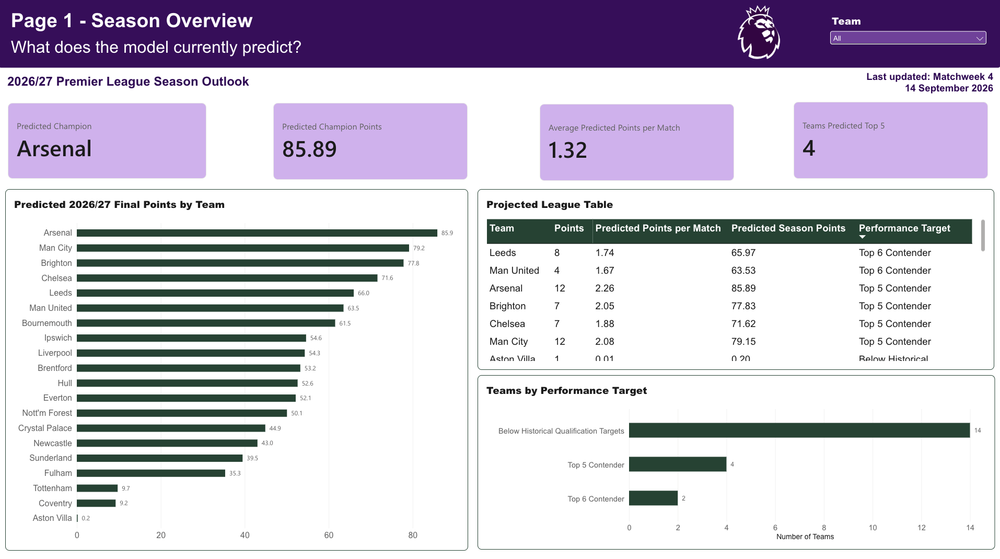
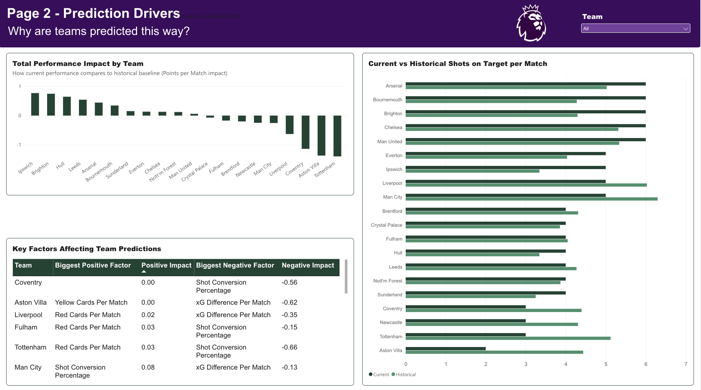
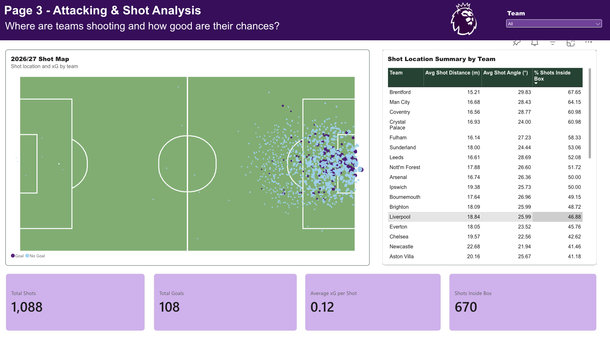
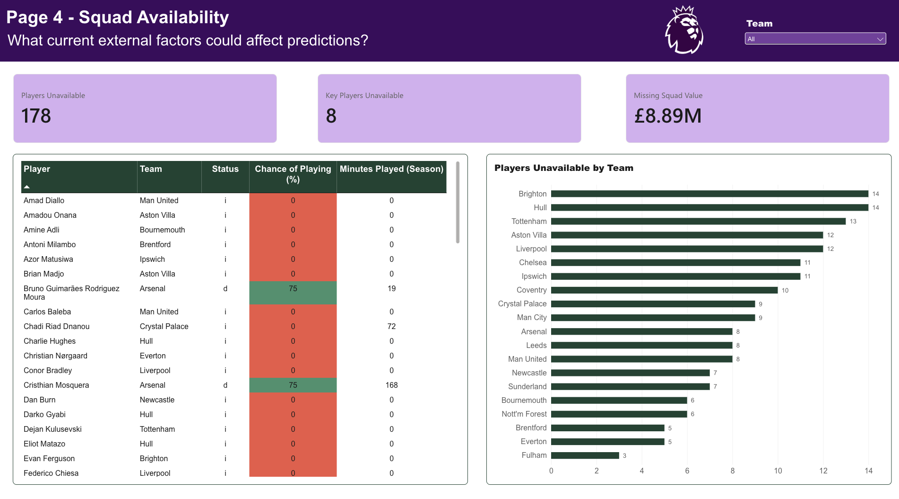

# Premier League Performance Dashboard | 2026/27 Season

## Project Overview

This project analyses Premier League team performance during the 2026/27 season and uses historical data and machine learning to estimate team success based on key performance metrics.

The project compares current team performance against historical performance baselines and estimates predicted points per match and predicted season points. Team-level performance is enriched with expected goals (xG), shot-level detail, and current squad availability.

Results are presented through a four-page Power BI dashboard, with the underlying Python pipeline refreshed weekly as new match data becomes available.

## Season

**Analysis Season:**  2026/27 Premier League Season

## Research Question

Which team performance metrics are most associated with Premier League success, and how can current-season performance be used to predict future league outcomes?

## Technologies Used

- Python
- Pandas
- NumPy
- Scikit-learn
- Matplotlib
- Power BI
- Git and GitHub

## Project Structure

```text
data/
├── raw/
│   ├── xG/
│   └── season-data/
└── processed/

src/git
├── 01_data_cleaning.py
├── 02_exploratory_analysis.py
├── build_historical_fact.py
├── 03_model_development.py
├── 04_current_season_analysis.py
├── 05_expected_performance_analysis.py
├── 06_fetch_shot_data.py
├── 07_shot_level_analysis.py
├── 08_xg_model_comparison.py
├── 09_shot_profile_dashboard.py
├── 10_build_powerbi_schema.py
├── 11_fetch_injury_status.py
└── run_weekly_pipeline.py

.gitignore
requirements.txt
README.md
```
### Script Summary

| Script                                 | Purpose                                                                                                          |
|-----------------------------------------|-------------------------------------------------------------------------------------------------------------------|
| `01_load_and_combine.py`               | Loads and combines raw match-result CSVs (2016/17-2025/26) into one dataset                                     |
| `02_create_team_season_data.py`        | Transforms match-level data into one row per team per season                                                    |
| `build_historical_fact.py`             | Merges historical team-season data with historical xG, producing the single source of truth read by `03`, `04`, `05`, and `08` |
| `03_exploratory_analysis.py`           | Explores relationships between team performance stats and points                                                |
| `04_current_season_analysis.py`        | Builds current-season team stats, trains the points-prediction model, and exports the Power BI dataset          |
| `05_expected_performance_analysis.py`  | Analyses historical xG data and its relationship with points                                                     |
| `06_fetch_shot_data.py`                | Fetches shot-level data from Understat for the current season                                                    |
| `07_shot_level_analysis.py`            | Processes shot-level data, decodes player-name encoding, and compares it against official match results         |
| `08_xg_model_comparison.py`            | Compares the shots/cards model against xG-augmented feature sets                                                 |
| `09_shot_profile_dashboard.py`         | Builds team shot-profile features (body part, situation, location) and a shot-level Power BI export              |
| `10_build_powerbi_schema.py`           | Consolidates every output into a Power BI-ready star schema: `dim_team` plus five fact tables                    |
| `11_fetch_injury_status.py`            | Fetches current player availability from the Fantasy Premier League API and builds a team-level injury/availability summary |
| `run_weekly_pipeline.py`               | Runs every script above in the correct dependency order, with fail-fast error handling                           |

## Pipeline Order
Scripts have real dependencies on each other's output, so they must run in this order (run_weekly_pipeline.py handles this automatically):

1. `01_load_and_combine.py` → `02_create_team_season_data.py`
2. `build_historical_fact.py`
3. `06_fetch_shot_data.py` → `07_shot_level_analysis.py`
4. `04_current_season_analysis.py`, `08_xg_model_comparison.py`, `03_exploratory_analysis.py`, `05_expected_performance_analysis.py`
5. `09_shot_profile_dashboard.py`
6. `11_fetch_injury_status.py`
7. `10_build_powerbi_schema.py`
Note: raw match-result CSVs (`season-2627.csv`) and the current-season xG snapshot (`xG2627.csv`) are manual downloads from football-data.co.uk and Understat respectively — nothing in this pipeline fetches those automatically. Update them before each weekly run.

## Power BI Data Model

`10_build_powerbi_schema.py` produces a star schema: one `dim_team` dimension table joined on `Team` to five fact tables.

| Table                                    | Grain                        | Description                                                                    |
|--------------------------------------------|-------------------------------|----------------------------------------------------------------------------------|
| `dim_team`                                | One row per team             | Canonical team list, historical season count, newly-promoted flag              |
| `fact_team_season_historical`             | Team + season                 | Historical team-season stats merged with historical xG (2016/17-2025/26)       |
| `fact_team_current_season`                | One row per team             | Current-season stats, model predictions, and performance recommendations       |
| `fact_shot_current_season`                | One row per shot              | Shot-level detail: location, body part, situation, result, xG                  |
| `fact_team_shot_profile_current_season`   | One row per team             | Team shot-profile aggregates: body part %, situation %, average distance/angle |
| `fact_team_injury_status`                 | Team + weekly snapshot        | Squad availability over time - grows one row per team per week                 |

## Power BI Dashboard

The Power BI dashboard consists of four pages designed to move from the overall prediction to the underlying performance factors, attacking data and squad availability.

1. Season Overview


Question: What does the model currently predict?
The Season Overview provides the high-level view of the 2026/27 season prediction.

It includes:
- Predicted champion
- Predicted champion points
- Average predicted points per match
- Teams predicted to finish in the top five
- Predicted final points by team
- Projected league table
- Performance target breakdown

This page provides the starting point for interpreting the model's current predictions.


2. Prediction Drivers


Question: Why are teams predicted this way?
This page examines the performance metrics contributing to the model's predictions.

It includes:
- Total performance impact by team
- Current vs historical shots on target per match
- Biggest positive performance factor
- Biggest negative performance factor
- Positive and negative factor impacts for each team

This page helps explain the factors behind differences in predicted team performance rather than presenting predictions as standalone outputs.


3. Attacking & Shot Analysis


Question: Where are teams shooting and how good are their chances?
This page uses shot-level data to examine the underlying attacking profile of the league.

It includes:
- Shot map using pitch coordinates
- Expected goals (xG) for individual shots
- Goal vs no-goal outcomes
- Shot distance and shot angle
- Percentage of shots inside the box
- Total shots
- Total goals
- Average xG per shot
- Team-level shot location summary


4. Squad Availability


Question: What current external factors could affect predictions?
This page incorporates current player availability into the analysis.

It includes:
- Players unavailable
- Key players unavailable
- Missing squad value
- Player availability status
- Chance of playing
- Minutes played during the season
- Players unavailable by team

## Weekly Updates

This project is designed to be updated weekly throughout the 2026/27 Premier League season.

Each update incorporates the latest available match results, team performance data, shot-level data and squad availability. Model predictions and Power BI dashboard insights are refreshed accordingly.

The dashboard, therefore, represents a live season-long analysis, with predictions changing as the season progresses.

## Future Improvements
- Automate raw match-result and xG snapshot downloads
- Compare additional machine learning models
- Extend shot-level features into the prediction model once sufficient historical shot data is available
- Build a historical injury/availability dataset across multiple seasons
- Incorporate squad availability into the prediction model
- Add additional team and match-level performance features